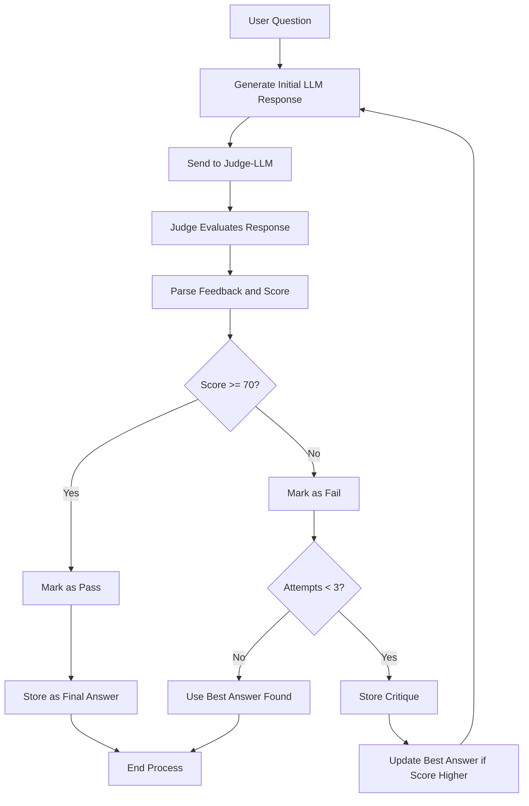

## DEEPSEEK AS A JUDGE
An open-source implementation of RAG system that uses LLMs-as-a-Judge evaluation mechanism. The system processes documents, generates responses, and employs an LLM judge to evaluate and improve answer quality through multiple iterations. If all iterations have been exhausted, best available answer will be chosen.

## Features
- Document processing and text chunking using nomic-embeddings
- Response with context retrieval (LLAMA 3.1)
- Self-evaluation mechanism with LLM judge (Deepseek)
- Iterative response improvement (3 Tries max)
- Multiple file format support (PDF, DOCX, PPTX, XLSX, CSV, TXT)

## System Architecture
The system consists of several key components:
1. **Document Processing**: Handles file uploads and text chunking
2. **Context Retrieval**: Uses embeddings to find relevant context for questions
3. **Response Generation**: Generates initial responses using LLM
4. **Judge System**: Evaluates responses and provides feedback
5. **Iterative Improvement**: Attempts up to 3 times to generate better responses

## FLOW-DIAGRAM

# Installation

- Make sure you have python and Ollama installed. Then go to directory where you want to download the repository in command prompt

- Create new virtual environment and activate. To do so in windows cmd, use following commands

      python -m venv my_env
      my_env\Scripts\activate

- Download the Zip file and extract into desired folder or Clone the repository using following command (Git must be installed otherwise download the zip file and extract it)

      git clone https://github.com/sallu-786/Multimodal_RAG.git

- Install the required libraries

        pip install -r requirements.txt

## Contributing
Contributions are welcome! Please follow standard GitHub pull request procedures.

## License
MIT